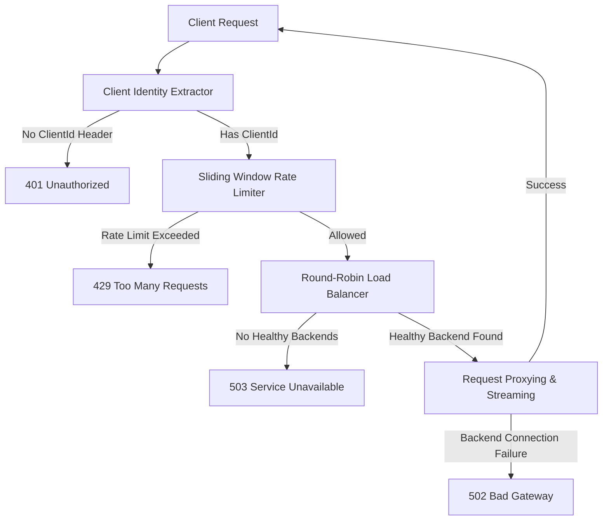

# Rust Rate Limiter Proxy

A high-performance, thread-safe rate-limiting reverse proxy implemented in Rust using the [Axum](https://github.com/tokio-rs/axum) web framework. This project serves as a robust implementation of the **Sliding Window Log** algorithm, designed to handle high-concurrency traffic with minimal overhead, active health checks, and round-robin load balancing.

---

## 🚀 Architecture Overview

The proxy acts as an intermediary gateway between clients and backend microservices. When a request arrives, it flows through the following pipeline:



### Key Components

1. **Client Identity Extractor**: Parses incoming headers to identify the client using the `ClientId` header.
2. **Sliding Window Log Rate Limiter**: Provides precise rate limiting per client ID. It tracks individual request timestamps in a thread-safe sliding window.
3. **Round-Robin Load Balancer**: Distributes traffic across a pool of active backend destinations.
4. **Active Health Checker**: Dynamically monitors the health of backend servers by periodically pinging their `/health` endpoint in a background thread, enabling auto-recovery and failover.

---

## 🛠 Features

- **Per-Client Rate Limiting**: Isolate and limit requests dynamically using the `ClientId` header.
- **Double-Checked Lock Pattern**: Lock contention is minimized by using a read-write lock (`RwLock`) on the client registry and granular mutexes (`Mutex`) on individual client logs.
- **Zero-Allocation Fast Path**: Efficient check paths lookup with `&str` references and entry APIs to avoid unnecessary allocations during high-throughput requests.
- **Active Health Monitoring & Auto-Failover**: Uses `ArcSwap` for lock-free backend host updates, dynamically removing unhealthy nodes and restoring them once they recover.
- **Monotonic Time Resilience**: Uses `std::time::Instant` to prevent clock manipulation from affecting the rate limits.
- **Fully Streaming Proxy**: Leverages Axum and reqwest's streaming capabilities to forward request and response bodies without buffering them fully into memory.
- **Dockerized**: A slim Docker configuration to minimize deployment footprints.

---

## 📂 Project Structure

```text
├── Cargo.toml                  # Dependencies & Rust edition configuration
├── Dockerfile                  # Multi-stage optimized Docker build configuration
├── README.md                   # Project documentation
└── src
    ├── configs
    │   ├── gateway_config.rs   # Balancer, Active Health Check, and Host registry
    │   ├── mod.rs              # Mod declaration for configs module
    │   ├── rate_limiter_gateway.rs # Rate Limiter registry with RwLock/Mutex pattern
    │   └── sliding_window_log.rs   # Sliding Window Log eviction & check logic
    ├── main.rs                 # Web entry point, background loops, and route handling
    └── utils
        ├── client_identity_extractor.rs # Client header extraction logic
        └── mod.rs              # Mod declaration for utils module
```

---

## 📦 Getting Started

### Prerequisites

- [Rust](https://www.rust-lang.org/tools/install) (Edition 2021, Rust 1.75+ recommended)
- [Docker](https://docs.docker.com/get-docker/) (optional)

### 1. Running Locally

```bash
# Clone the repository
git clone https://github.com/your-username/rust-rate-limiter.git
cd rust-rate-limiter

# Run the proxy (defaults to port 3000)
cargo run
```

### 2. Running with Docker

```bash
# Build the production image
docker build -t rate-limiter:v2 .

# Run the container (binds to host port 3000)
docker run -d -p 3000:3000 \
  --name operational-gateway \
  rate-limiter:v2
```

---

## 🧪 Verification & Testing

Verify that rate-limiting, load balancing, and health checking work using `curl`.

### Test 1: Missing Client Identity Header
```bash
curl -i http://localhost:3000/
```
**Expected Response**: `401 Unauthorized`

### Test 2: Successful Request and Round-Robin Routing
```bash
curl -i -H "ClientId: client-1" http://localhost:3000/
curl -i -H "ClientId: client-1" http://localhost:3000/
```
**Expected Response**: Alternating responses from backend `5000` and backend `5001`:
```text
Hello from Backend on port 5000! Path: /
Hello from Backend on port 5001! Path: /
```

### Test 3: Exceeding Rate Limit
By default, the rate limit is configured to **10 requests per 1 second** per client. Run a quick loop to exceed the rate limit:
```bash
for i in {1..15}; do curl -s -o /dev/null -w "%{http_code}\n" -H "ClientId: client-2" http://localhost:3000/; done
```
**Expected Response**: The first 10 requests return `200`, followed by `429` for the subsequent requests:
```text
200
...
200
429
429
```

---

## ⚙️ Configuration

You can customize the proxy behavior by modifying [src/main.rs](src/main.rs):

```rust
// In src/main.rs
let gateway_config = GatewayConfig::new(
    // RateLimiterGateway::new(sliding_window_duration, max_requests_per_window)
    RateLimiterGateway::new(Duration::from_secs(1), 10),
    
    // Configured backend host list
    vec![
        "http://localhost:5000".to_string(),
        "http://localhost:5001".to_string(),
    ],
    http_client.clone(),
)
.await;
```

---

## 🛡 Status Codes Reference

The proxy returns specific status codes to signal proxy-related states:

| Status Code | Description | Trigger Condition |
| :--- | :--- | :--- |
| **`401 Unauthorized`** | Unauthorized | Request is missing the `ClientId` header. |
| **`429 Too Many Requests`** | Rate Limit Exceeded | Client exceeded the configured requests limit within the window. |
| **`502 Bad Gateway`** | Bad Gateway | The backend destination is online but failed to complete the request. |
| **`503 Service Unavailable`** | Service Unavailable | All backend destinations failed health checks. |

---

## 📝 License

This project is open-source and available under the [MIT License](LICENSE).
